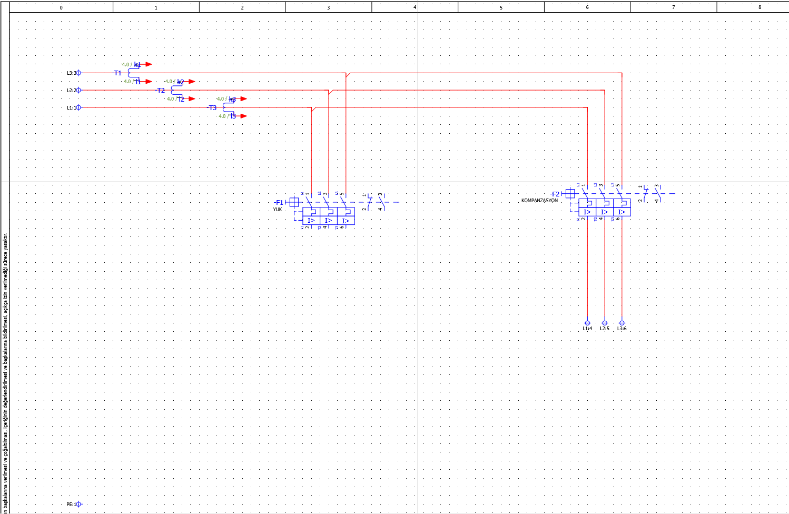
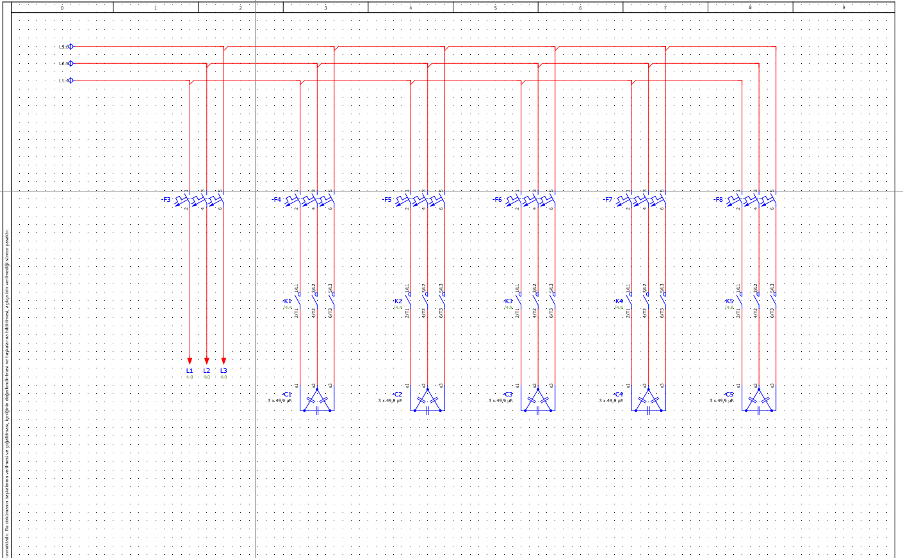
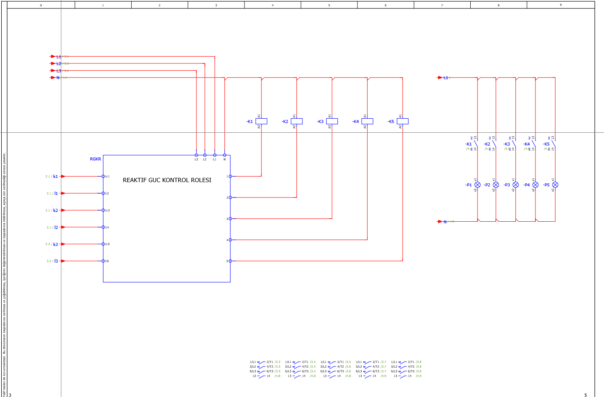
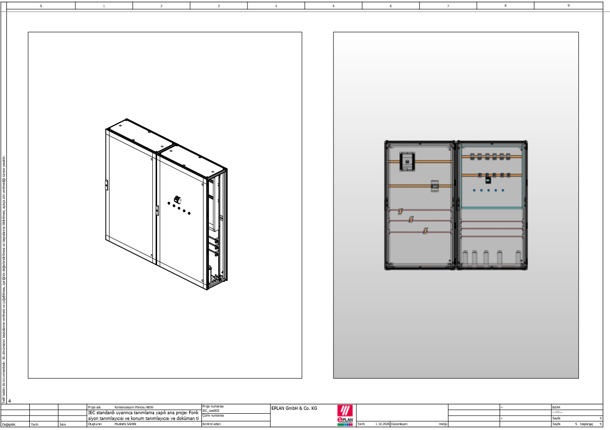

# EPLAN Kompanzasyon Panosu Projesi

EPLAN Electric P8 kullanılarak hazırlanmış kompanzasyon ve güç panosu tasarım çalışmasıdır. Projede güç dağıtımı, kompanzasyon kademeleri, reaktif güç kontrolü ve 3D pano yerleşimi üzerine çalışılmıştır.

## Kullanılan Yazılım

- EPLAN Electric P8

## Proje İçeriği

- Üç fazlı ana güç dağıtım devresi
- Kompanzasyon kademeleri
- Kontaktör ve kondansatör bağlantıları
- Reaktif güç kontrol rölesi bağlantıları
- Kademe durumlarını gösteren sinyal lambaları
- 3D pano yerleşim çalışması

## Ana Güç Dağıtımı

Ana besleme ve kompanzasyon panosuna ait güç dağıtım devresi.

## Kompanzasyon Kademeleri

Kontaktörler üzerinden devreye alınan kondansatör kademelerinin güç devresi.

## Reaktif Güç Kontrol Devresi

Reaktif güç kontrol rölesinin kompanzasyon kademelerini kontrol ettiği kumanda devresi.

## 3D Pano Tasarımı

EPLAN Pro Panel ortamında oluşturulan pano ve ekipman yerleşim çalışması.

## Proje Dosyası

EPLAN proje yedek dosyası (`.zw1`) repository içerisinde bulunmaktadır. Proje EPLAN Electric P8 üzerinden restore edilerek incelenebilir.

## Amaç

Bu çalışma, EPLAN Electric P8 üzerinde elektrik şeması oluşturma, kompanzasyon sistemi yapısını anlama ve temel 3D pano tasarımı konusunda uygulama yapmak amacıyla hazırlanmıştır.
